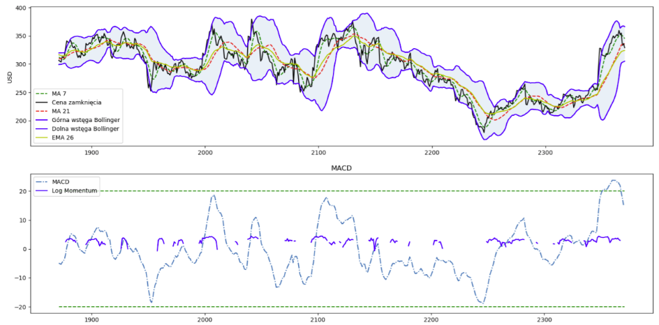
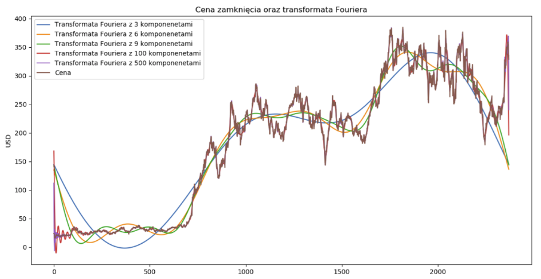
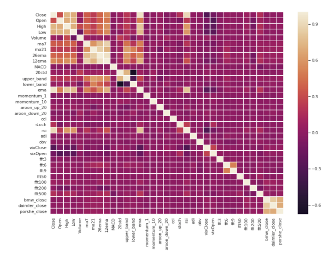
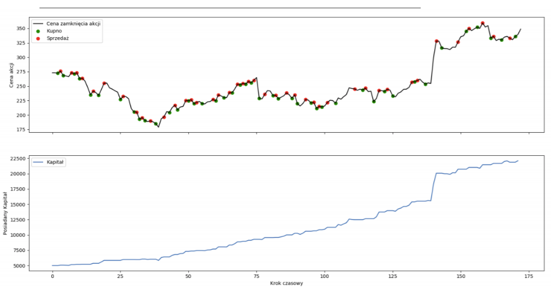

StockPricePrediction
==============================

Tesla's stock closing price prediction using Deep Neural Networks.
- Input data are historical Tesla's stock data OHLCV (Open, High, Low, Close, Volume)
- Features are based on technical analysis and fourier Transforms
- Includes multiple DNN architectures based on layers: dense, LSTM, GRU, CONV1D
- All models predictions are tested in trading simulation where actions such as buy, sell, hold are based on model's predictions

-Technical Analysis

-Fourier Transforms

-Correlation Matrix

Trading History (green=buy, red=sell)

Project Organization
------------

    ├── LICENSE
    ├── README.md          <- The top-level README for developers using this project.
    ├── data
    │   ├── external       <- Data from third party sources.
    │   ├── interim        <- Intermediate data that has been transformed.
    │   ├── processed      <- The final, canonical data sets for modeling.
    │   └── raw            <- The original, immutable data dump.
    │
    ├── models             <- Trained and serialized models, model predictions, or model summaries
    │
    ├── notebooks          <- Jupyter notebooks.
    │
    ├── reports            <- Generated analysis as HTML, PDF, LaTeX, etc.
    │   └── figures        <- Generated graphics and figures to be used in reporting
    │
    ├── requirements.txt   <- The requirements file for reproducing the analysis environment, e.g.
    │                         generated with `pip freeze > requirements.txt`
    │
    ├── setup.py           <- makes project pip installable (pip install -e .) so src can be imported
    ├── src                <- Source code for use in this project.
    │   │
    │   ├── data           <- Scripts to download or generate data
    │   │
    │   ├── features       <- Scripts to turn raw data into features for modeling
    │   │
    │   ├── models         <- Scripts to train models and then use trained models to make
    │   │                     predictions
    │   │
    │   └── visualization  <- Scripts to create exploratory and results oriented visualizations

